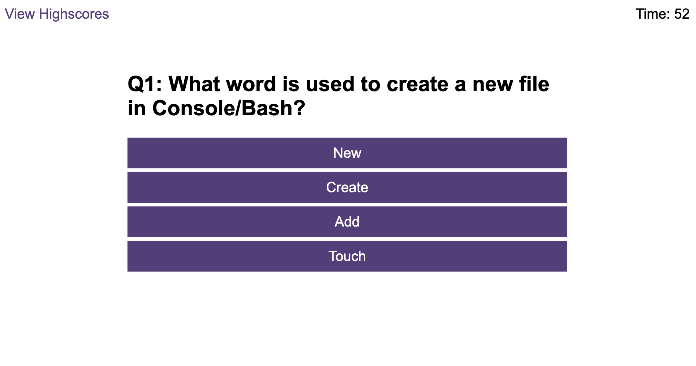

# Code_quiz

## Description
The aim of this project was to build a timed coding quiz with multiple-choice questions. This app will run in the browser, and will feature dynamically updated HTML and CSS powered by JavaScript code that you write.

The application needs to...
Have a timer start when I click the start button and be presented with a question.
When I answer a question I am presented with another question.
When I answer a question incorrectly time is subtracted from the clock.
When all questions are answered or the timer reaches zero then the game is over.
When the game is over I can store my score with initials.

## Installation

N/A

## Usage

The application can be accessed via an internet browser and the results can be seen in the console.

Link: https://drrobertson9673.github.io/Code_quiz/

## Credits

N/A

## License

MIT licence